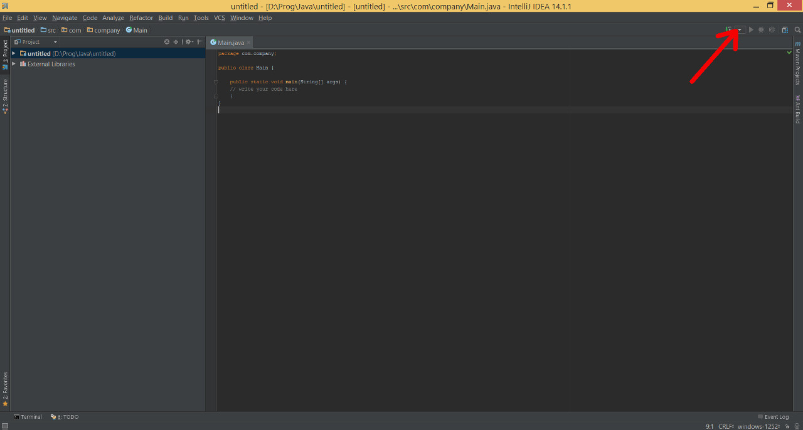

# Linked Open Data (LOD)
Repository containing all my work on Linked Open Data (LOD), supervised by professor Amagasa at KDE's lab (Tsukuba University, Japan)

## How to compile code to .jar

### Prerequisites
* This project is powered by Maven, a project management tool. ([Install Maven](http://maven.apache.org/guides/getting-started/maven-in-five-minutes.html))
* *(OPTIONAL)* IntelliJ's project files are supplied for those who want to use it. ([Install IntelliJ](https://www.jetbrains.com/idea/download/))

### Configure with Maven
About configuration, you only need to install project dependencies which are required to build the differents .jar.
This can be done by entering the following instruction when you are in the directory "LOD" :
```
mvn install
```
Now everything should be fine to compile every module.

### Compile the different modules with Maven

* In a command shell, go to "LOD/%MODULE_DIR%", where %MODULE_DIR% is the main directory of a module
* Enter the following instruction :
```
mvn package
```
The .jar should be present at "LOD/%MODULE_DIR%/target"

For example, if you want to compile the jp.kde.lod.jacquet.fbexplorer.App Module :
* Go to "LOD/jp.kde.lod.jacquet.fbexplorer.App"
* Enter the following instruction :
```
mvn package
```
The .jar should be present at "LOD/jp.kde.lod.jacquet.fbexplorer.App/target"

### Configure with IntelliJ

#### Open the project under IntelliJ
Launch IntelliJ and under "File/Open" select "LOD" directory

#### Create a configuration
If you don't want to use a command line shell to compile a module, you can create configurations under IntelliJ, whose purpose is to automate the build, or to execute any other command line you often use.


At the top-right of the application, click on the arrow of the build configuration as shown below.



Select "Edit configuration". The configurations dialog box should be open. Click on '+' to add a configuration and select :
* If you want to make a build configuration which launch the .jar after compilation : "Application"
  * Fill the *"Main Class"* field with the name of the main class of the module you want to build (*by convention, I always call them "jp.kde.lod.jacquet.fbexplorer.App"*)
  * Fill the *"Working Directory"* field with **"$MODULE_DIR$"**
  * In the list of the modules labelled by *"Use classpath of mod ..."* select the module you want to build.
  * In the *"before launch"* part, remove the "Make" goal and add a *"Maven Goal"* with the line command ``compile``
* If you want to make a Maven configuration : "Maven"
  * Fill the *"Working Directory"* field with the directory of the target module (*you can choose directory of a specific module with the button at the right of the text field*)
  * Fill the "Command line" field with the maven command line you want to execute (*if you want to automate the maven command ``mvn package``, just write ``package``*)


